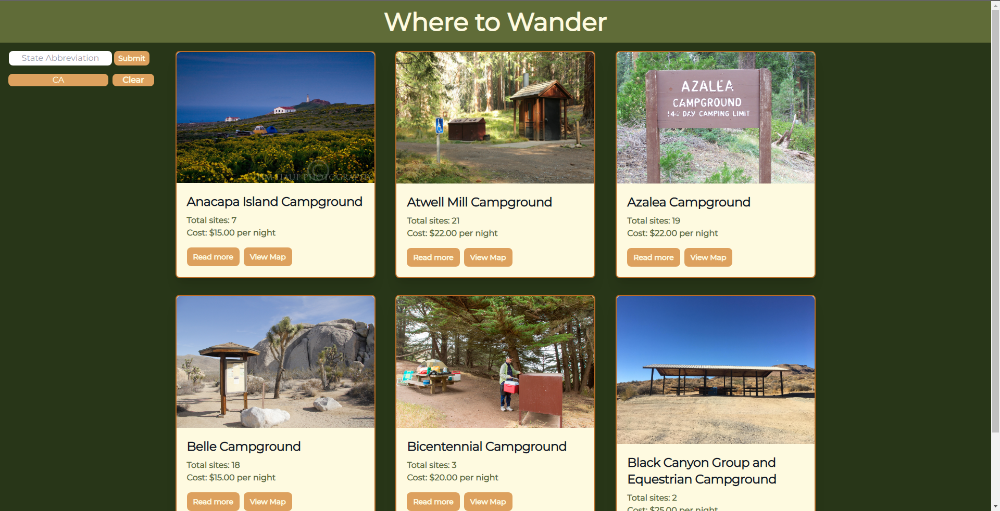

# Where to Wander

## Description

- Our motivation for this project was to use all the skills we've learned in the past 2 months to make a campground search application. As avid hikers, and outdoors fanatics, we felt like this project made sense to us.
- We built this project for everyone who loves to be outdoors, and wants a quick way to find campgrounds in states they input!
- We learned so much during this project, personally I learned how to use fetch more reliably, and then parse/use the data to output what I needed. As a team, we found out ways to make our hectic schedules work together. We also learned a lot about Tailwind, and how it operates.

## Installation

No installation required! Just go to, [Where to Wander](https://norklas.github.io/project-one/)!

## Usage

To use our website, simply provide a state abbreviation in the input, and click search. Upon submitting, six campgrounds will be generated listing total sites, and cost per night. Under that list, you will have a read more button to go to the NPS.gov link for that specific campground. There is also a view map button to show where it is located on a static map image that the Mapbox API provided. If you do not enter a state abbrevation, a modal will pop up prompting you that you must enter one. As you search for campgrounds, a list will be appended underneath the search bar for your search history, you can then click on them to go back to that search. Using the clear button will clear both the list, and your local storage.

## Credits

My collaborators for this project were, [Kerri](https://github.com/KerriAnn1), [Ryan](https://github.com/ryanzubayer), and [Mattew](https://github.com/MatthewT12)!

Technologies used were, [jQuery](https://api.jquery.com/), [TailwindCSS](https://tailwindcss.com/docs/installation), [Google Fonts](https://fonts.google.com/), [NPS Campground API](https://www.nps.gov/subjects/developer/api-documentation.htm#/campgrounds/getCampgrounds), and [Mapbox API](https://docs.mapbox.com/api/overview/). We relied heavily on all of the documentation for jQuery, TailwindCSS, NPS Campground API, and Mapbox API.

